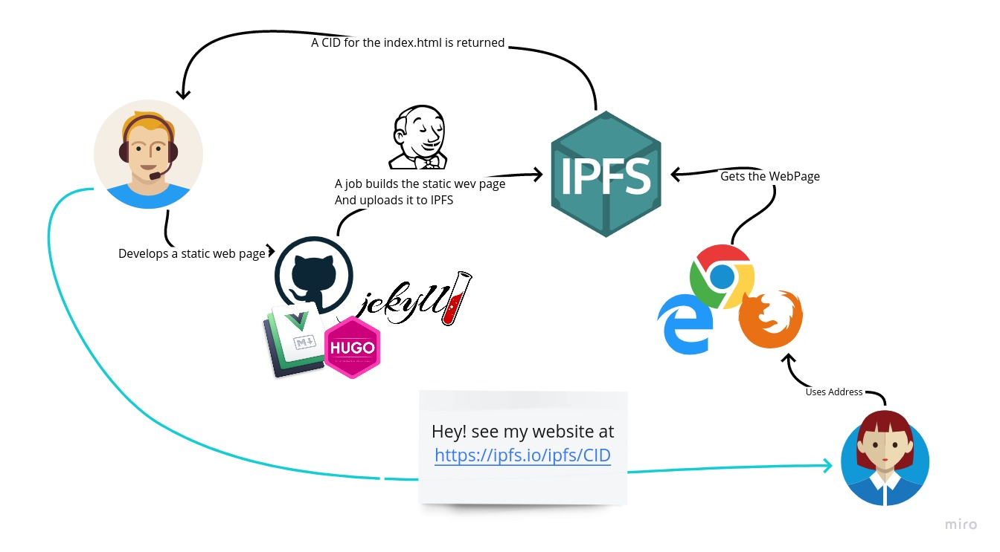

# blogger-ipfs

A InterPlanetary File System based blog post platform

This project aims to show how it's possible to deploy a static website using the IPFS protocol.

Normally a static website is created using regular HTML or Frameworks like Jekyll, Hugo, Next.js, Gatsaby or even Vuepress.
After that a webserver (nginx, or others) would provide that website.

That is problematic because is a centralised system that can fail and isso not public.


IPFS comes to the rescue providing a flow that is decentralised and can be maintained by the community forever.


## How it works




```bash

make deploy

```

### The result being

```bash

{
  path: 'dist/guide',
  cid: CID(QmNy7No1e18K3kQrYEBiqbg5EiK4J4LvvwF5qxqjNGrCAr),
  size: 15345
}
{
  path: 'dist',
  cid: CID(QmWJTbMJzYFX3J3MDVjh5hrZPWEWnLCADtVjDsdQvoUeJ1),
  size: 301344
}
WebSite upload was a success!!!
The index.html CID is: CID(QmU7ppwvWsm53dqYayTdPv52LKvjxu5xJmPXkif7jgCqnU)
To use add the address https://ipfs.io/ipfs/ to it:
Like this: https://ipfs.io/ipfs/QmU7ppwvWsm53dqYayTdPv52LKvjxu5xJmPXkif7jgCqnU
make[1]: Leaving directory '/home/jmr/Projects/blogger-ipfs'

```
